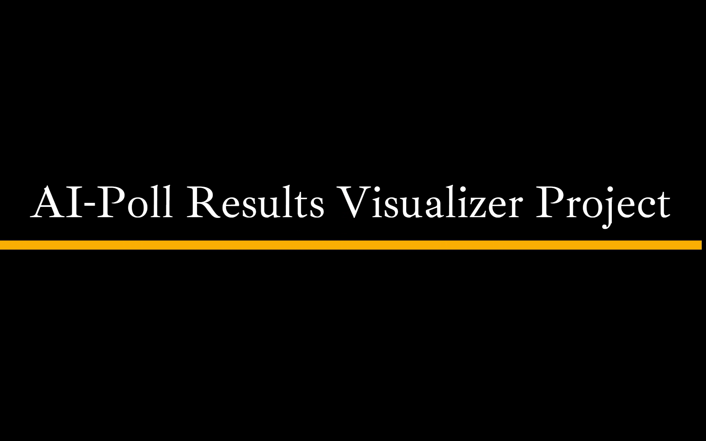
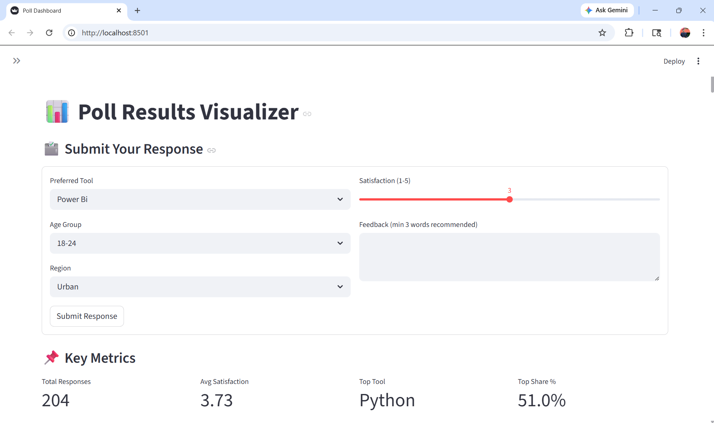
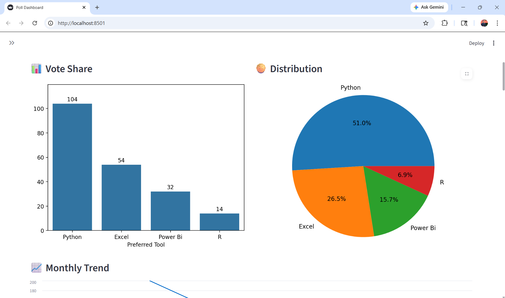
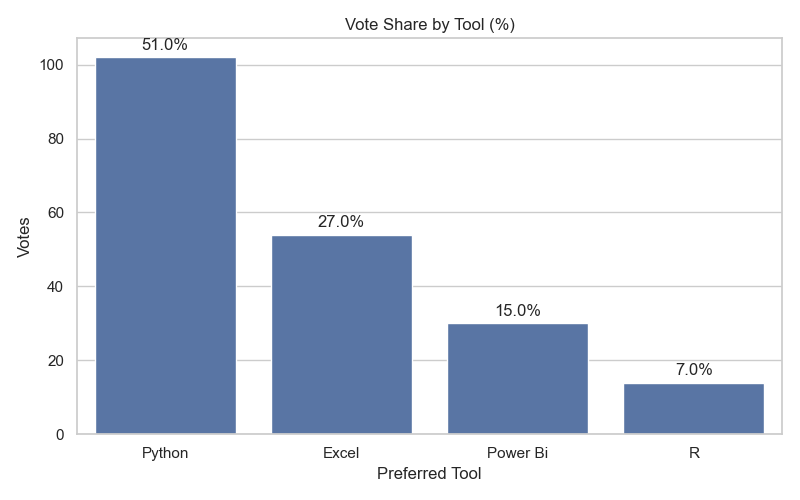
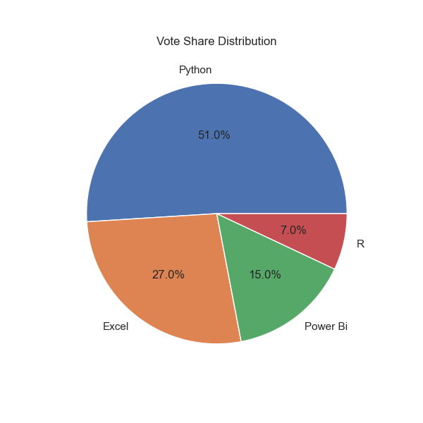
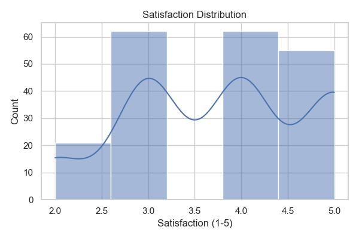
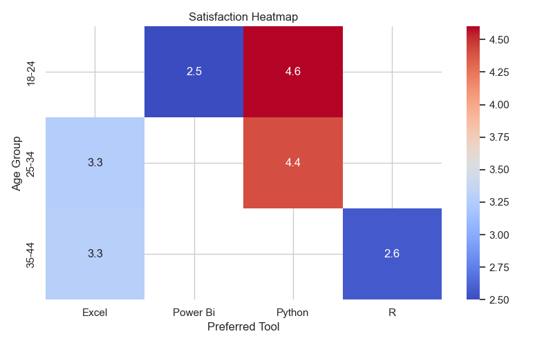
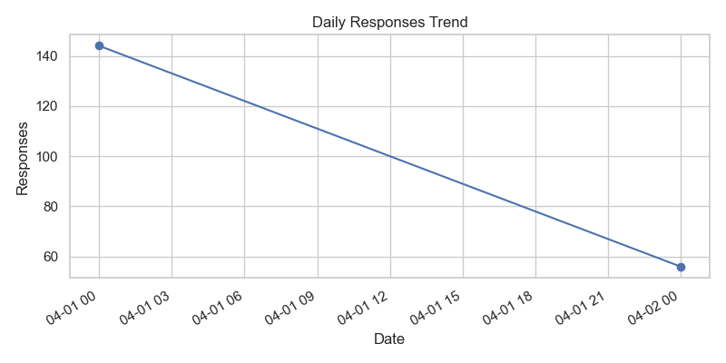
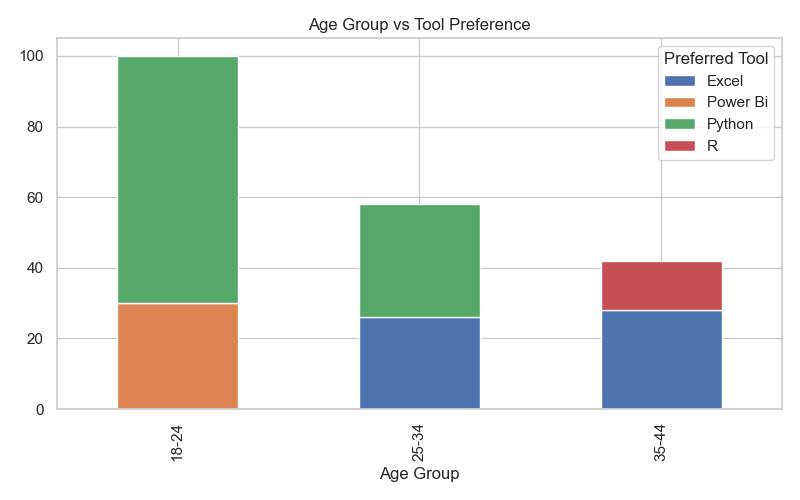
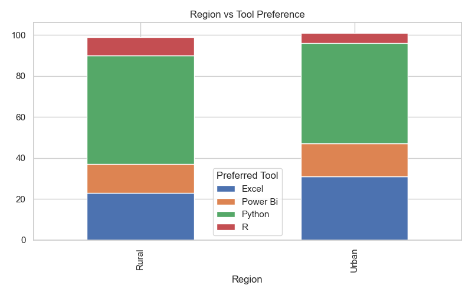

# 📊 Poll Results Visualizer (AI-Powered Survey Analytics System)


---

## 📌 Overview

This project is a **complete end-to-end Poll & Survey Analytics System** built using Python and Streamlit.

It converts raw survey data into:

* 📊 Interactive dashboards
* 📈 Visual insights
* 🧠 NLP-based feedback analysis
* 📌 Decision-ready insights

---

## 🎥 Demo Video

[](images/demo_project3.mp4)

---

## 📊 Dashboard Preview




---

## 🛠 Problem Statement

Organizations collect survey data but face issues:

* ❌ Raw data is hard to understand
* ❌ Manual analysis is slow
* ❌ No clear insights
* ❌ No visualization system

---

## ✅ Solution

This system:

* Cleans and processes poll data
* Calculates vote share & trends
* Generates charts automatically
* Performs NLP on feedback
* Provides an interactive dashboard

---

## 🏭 Industry Relevance

| Industry        | Use Case                      |
| --------------- | ----------------------------- |
| Market Research | Customer feedback analysis    |
| HR Analytics    | Employee satisfaction surveys |
| Education       | Student feedback analysis     |
| Politics        | Election poll analysis        |
| Product Teams   | Feature preference insights   |

---

## 📊 Business Impact

* ⚡ Faster decisions
* 📉 Less manual work
* 📈 Better insights
* 🧠 Data-driven thinking

---

## ⚙ Tech Stack

* **Language:** Python
* **Data Processing:** Pandas, NumPy
* **Visualization:** Matplotlib, Seaborn
* **NLP:** TextBlob, WordCloud
* **Dashboard:** Streamlit

---

## 📊 Dataset

Synthetic Poll Dataset

### Features:

* Timestamp
* Respondent_ID
* Age Group
* Gender
* Region
* Preferred Tool
* Satisfaction (1-5)
* Feedback

---

## 🏗 System Architecture

```
Raw Data → Data Cleaning → EDA → Analysis → Visualization → NLP → Insights → Dashboard
```

---

## 📁 Project Structure

```
AI-POLL-RESULTS-VISUALIZER/
├── .venv/
├── app/
│   └── app.py
├── data/
│   ├── cleaned_poll_data.csv
│   └── poll_data.csv
├── images/
├── notebooks/
├── outputs/
│   ├── insights_report.txt
│   ├── satisfaction_by_tool.csv
│   └── vote_share.csv
├── src/
│   ├── advanced_visuals.py
│   ├── analysis.py
│   ├── data_cleaning.py
│   ├── data_generator.py
│   ├── eda_analysis.py
│   └── insights.py
├── venv/
├── main.py
├── README.md
└── requirements.txt

```

---

## ⚙ Installation & Setup

```
git clone https://github.com/maheshbhakre/poll-results-visualizer.git

cd poll-results-visualizer

python -m venv venv
venv\Scripts\activate

pip install -r requirements.txt
```

---

## 🖥 Usage

### Step 1: Clean data

```
python src/data_cleaning.py
```

### Step 2: Run dashboard

```
streamlit run app/app.py
```

---

## 📊 Key Visualizations

### 🔹 Vote Share




### 🔹 Satisfaction Analysis




### 🔹 Trends



### 🔹 Demographics




---

## 🧠 NLP Insights

* ☁️ Word Cloud
* 😊 Sentiment Analysis
* 🔑 Keyword Extraction

---
## 📸 Phase-wise Implementation Proof

### 🔹 Phase 1


---

### 🔹 Phase 2


---

### 🔹 Phase 3


---

### 🔹 Phase 4


---

### 🔹 Phase 5


---

### 🔹 Phase 6


---

### 🔹 Phase 7


---

## 🧠 Key Insights

* Python is most preferred
* R is least preferred
* Avg satisfaction ≈ 3.7
* Urban → Power BI usage high
* Young users → Python

---

## 👨‍💻 Author

Mahesh Bhakre

---

## 🌐 CONNECT WITH ME

<a href="https://github.com/maheshbhakre">

</a>

<a href="https://www.linkedin.com/in/maheshbhakreds1242">

</a>

<a href="https://www.instagram.com/mahesh_bhakre__2k06">

</a>

<a href="https://saimfsd.github.io/mahesh-portfolio/">

</a>

---

## ⭐ NOTE

This project demonstrates:

* Data Cleaning
* EDA
* Analysis
* Visualization
* NLP
* Dashboard

---

## 🚀 Future Improvements

* Live polling system
* Real-time updates
* API integration
* Power BI dashboard
* Advanced NLP

---

## 🎯 Interview Tip

> “I built an end-to-end Poll Results Visualizer that processes survey data, performs analysis, applies NLP on feedback, and presents insights through an interactive dashboard using Streamlit.”

---
